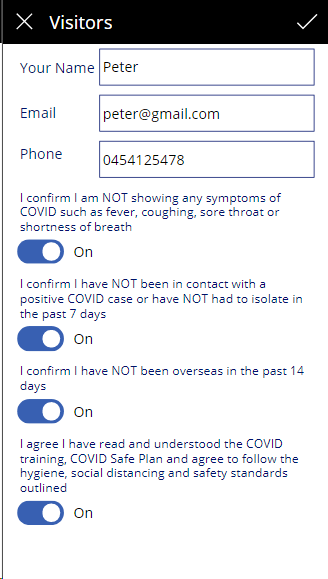
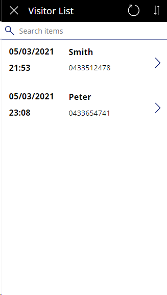
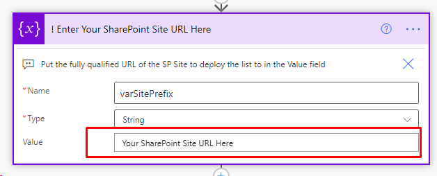

# Visitors Check-in PowerApps Template
This Power App allow your visitors to check in/out. It is created for the COVID-19 scenario. But you can modify it to suit your needs.

- Allow visitor to check-in
- Allow visitor to check-out
- Search for visitor

# How to deploy
1.  Download the Visitors Check-In PowerApps zip file and the Desk Visitors List Provisioner Zip file
2.  Go to flow.microsoft.com
3.  Import the Visitors List Provisioner Zip file into Cloud flows
4.  Edit the 2nd Action "! Enter Your SharePoint Site URL Here" and put in your SharePoinst site url. 

6. Run the "Visitors List Provisioner" Flow. This will create the a list named "Visitors" in your Sharepoint site.
7.  Go to make.powerapps.com
8.  Click on the Apps tabs on the left hand side
9.  Click 'Import Canvas App' to import the Visitors Check-In PowerApps zip file
10.  edit the imported app
11.  Click the data connections tab and add a SharePoint Data Connections in the app
12.  Search for SharePoint and add in the new "Visitors" list that created in step 6
13.  Save the app and enjoy it.
